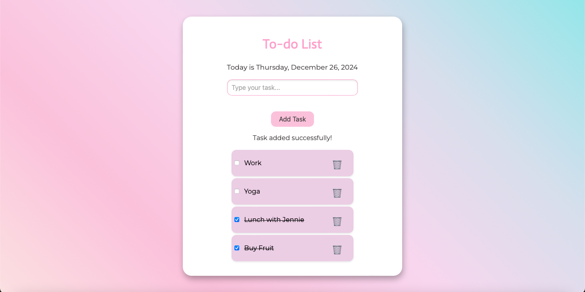

# To-do List Project with HTML, CSS, and JS

## Overview

I first designed the project layout on Canva, choosing a color palette of blue, lilac, and pink. My goal was to create something fun, feminine, and user-friendly.

## Features

- Add your tasks using the input field.
- The date is automatically updated to the current date.
- Use the checkbox to mark tasks as completed.
- Delete tasks using the "trash bin" icon as per your preference.

## Project Screenshot

